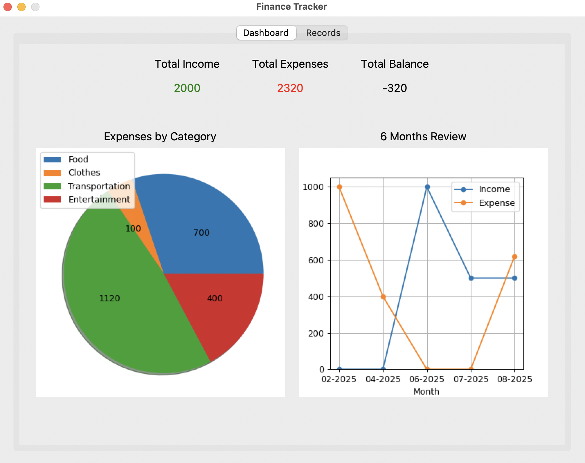
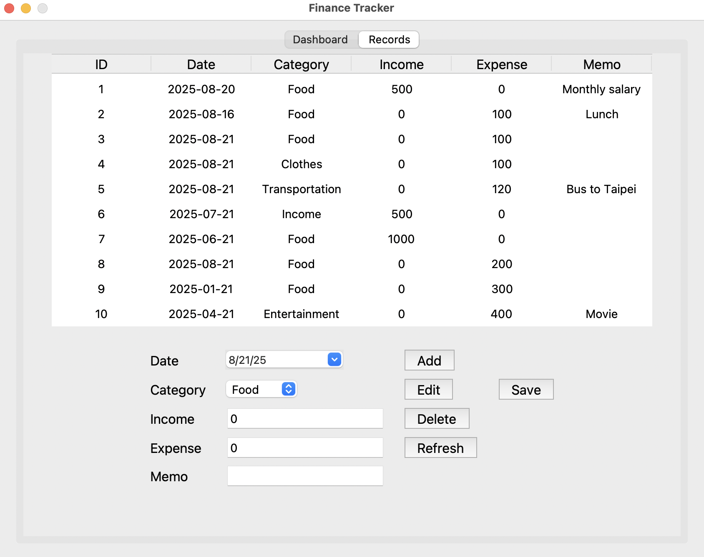

# Finance Tracker
A simple finance tracker
Main tools: Tkinter, sqlite3

## Features
Dashboard:
- Overview of total finance indicators
- Pie chart of expense analysis by category
- Line chart of income and expense for past 6 months 

Records:
- Complete list of income and expenses
- Add a record
- Edit a record by selecting a row from the list and clicking the edit button. Modify the details and click save when done.
- Delete a record by selecting a row and clicking the delete button.
- The information on records list and dashboard should update when changes to the database are made.

##  Setup
Prerequisites:
Python 3.9+

Installing libraries:
- refer to requirements.txt

## Executing program
1. Run dbinit.py to initialize the database
2. Run main.py to start using the finance tracker

## Functions to add in future
- Monthly/weekly review
- Manager tab: modify categories
